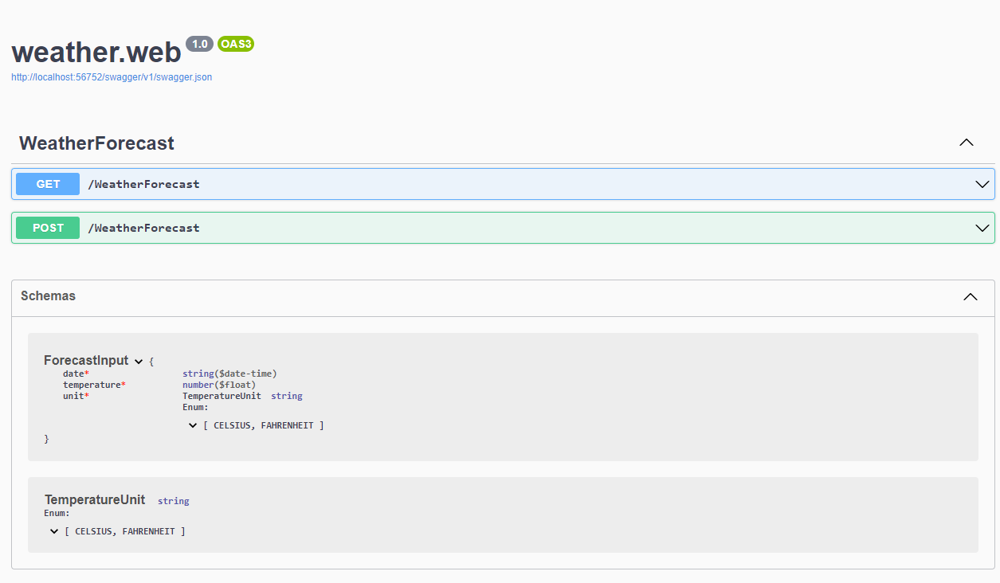

# Weather Forecast Report API

This API allows a weatherman to store weather forecasts (temperature) per day. An frontend application can retrieve a week (7 days) forecast showing temperatures in a "feel like" format (e.g.: "Chilly" or "Cool").

Conversion between temperature numeric value submited by weatherman and the returned value on a "feel like" textual format follows the rules in the table below.

| Temperature interval (Celsius) | Feels Like |
|:------------------------------:|:----------:|
|          \] -60 , 0 \]         | Freezing   |
|          \] 0 , 5 \]           | Bracing    |
|          \] 5 , 10 \]          | Chilly     |
|          \] 10 , 15 \]         | Cool       |
|          \] 15 , 20 \]         | Mild       |
|          \] 20 , 25 \]         | Warm       |
|          \] 25 , 30 \]         | Balmy      |
|          \] 30 , 35 \]         | Hot        |
|          \] 35 , 40 \]         | Sweltering |
|          \] 40 , 60 \]         | Scorching  |

> :warning: Reported values bellow -60 or above 60 are not allowed


## Assumptions

1. Weather forecast returned to the user will a list of temperatures (in an human feels like text form) for a 7 day's week, starting from current day (not including).
2. If a forecast is submited for a day already in the database it will update the existing forecast.
3. Inputs can be done in Celsius or Fahrenheit units but values stored in database are always in Celsius.
 
## API endpoint details 
### Forecast sumbission details (POST /weatherForecast)

1. Reported data cannot be in the past
2. Temperature max value is 60 (Celsius)
3. Temperature min value is -60 (Celsius)
4. Request POST payload for daily forecast submission will be a JSON with properties:
    * date (forecast date in format yyyy-mm-dd)
    * temperature (temperature value e.g.: 20.5 )
    * unit (can be 'CELSIUS' or 'FAHRENHEIT')
    ```json
    {
        "date": "2022-04-29",
        "temperature": 104,
        "unit": "FAHRENHEIT"
    }
    ```
    
5. Response is a JSON with a success flag an error message (not emtpy in case of error)
    ```json
    {
        "success": true,
        "errorMessage": ""
    }
    ```

## Weather week forecast (GET /weatherForecast)

1. Response will be a JSON to be consumed by an webbased widget (e.g. React.js). Forecast items will have the forecast date and the temperature for that day in a "feel like" non-numeric format: 
    
    ```json
    {
      "forecastByDay": [
        {
          "date": "04/25/2022",
          "temperatureFeel": "Cool"
        },
        {
          "date": "04/26/2022",
          "temperatureFeel": "Cool"
        },
        {
          "date": "04/27/2022",
          "temperatureFeel": "Mild"
        },
        {
          "date": "04/28/2022",
          "temperatureFeel": "Warm"
        },
        {
          "date": "04/29/2022",
          "temperatureFeel": "Warm"
        },
        {
          "date": "04/30/2022",
          "temperatureFeel": "Warm"
        },
        {
          "date": "05/01/2022",
          "temperatureFeel": "Balmy"
        }
      ],
      "success": true,
      "errorMessage": ""
    }
    ```

## Run the API
The API was build in .NET 6.0 using Visual Studio. To run with Visual Studio just run the docker-compose start option for project weather.web

To run from the console go to the repository root and run:
```
> docker-compose up
```

## API Swagger

API swagger looks like

